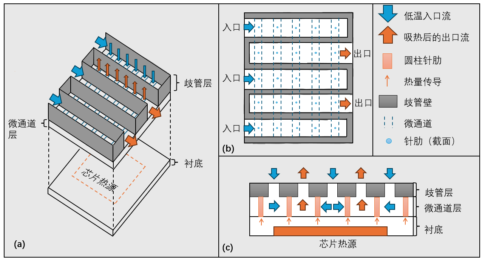
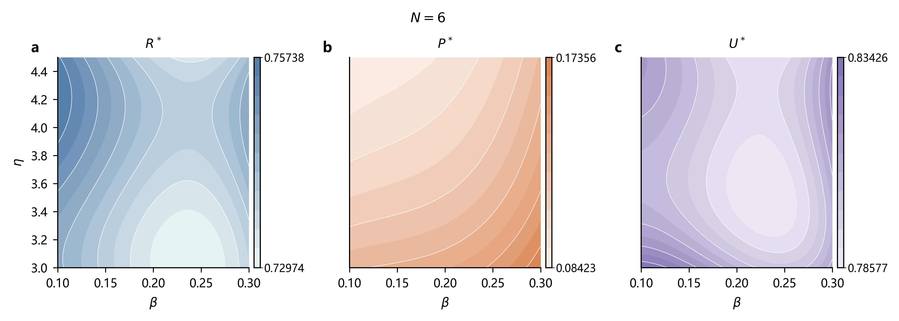

# Manifold Microchannel Thermal Optimization

Reproducible physics-guided modelling, surrogate prediction, and multi-objective design optimization for a manifold microchannel chip-cooling task.

[](https://github.com/AlanAkillove/Manifold-Microchannel-Thermal-Optimization/actions/workflows/ci.yml)

[Paper PDF](docs/paper/tex/main.pdf) · [AI tool details](docs/paper/tex/AI工具使用详情.pdf) · [Results](outputs/results.json) · [中文说明](README.zh-CN.md) · [License](LICENSE)



## Highlights

- Physics-guided interpretation of manifold flow distribution, pin-fin heat transfer, and chip/substrate conduction.
- Cubic response-surface surrogates compared with quadratic and Gaussian-process baselines.
- Multi-objective Pareto optimization over dimensionless thermal resistance, pressure drop, and temperature non-uniformity.
- Weight-simplex acceptability regions for preference-robust design selection.
- Parameter-sensitivity analysis, uncertainty checks, machine-readable results, and regression tests.

## Key results

| Result | Finding |
| --- | --- |
| Surrogate validation | Cubic RSM five-fold RMSE: `3.46e-7`, `5.59e-4`, and `3.00e-4` for `R*`, `P*`, and `U*` |
| Nominal compromise | `beta = 0.22494`, `eta = 4.50`, `N = 6` under the Chebyshev criterion |
| Preference-robust region | `beta in [0.215, 0.224]`, `eta = 4.50`, `N = 3-4`; fine-grid coverage `49.99%` |
| Grid stability | The `401 x 301` fine-grid check retains the nominal `N = 6` solution |
| Parameter uncertainty | At up to `+/-5%` perturbation, pressure drop controls the largest degradation: `7.10%` and `6.62%` for the two representative designs |



## Methodology

The workflow reads 84 supplied records: four no-pin-fin baseline samples and a `4 x 4 x 5` full-factorial design with pin fins. It first uses conservation relations and scaling analysis to interpret the system. It then compares polynomial response surfaces and Gaussian-process models using interlaced five-fold validation, leave-one-out validation, an internal `N`-level holdout, and a central `beta-eta` block holdout. Finally, it enumerates the integer pin-fin row count, searches the continuous geometry parameters, partitions the weight simplex, and evaluates parameter perturbations.

## Reproduction

Python 3.10 or later is required. A virtual environment is recommended:

```powershell
python -m venv .venv
.venv\Scripts\Activate.ps1
```

```bash
python -m venv .venv
source .venv/bin/activate
```

Install the project and development dependencies on either platform:

```text
python -m pip install --upgrade pip
python -m pip install -e ".[dev]"
```

Run the fast smoke check first:

    python scripts/run_analysis.py --quick
    python -m pytest -q

The full analysis regenerates the processed data, all result tables, and `outputs/results.json`:

    python scripts/run_analysis.py --full
    python scripts/make_figures.py
    python -m pytest -q

The quick check normally takes less than 15 seconds. The full analysis takes roughly 10–15 minutes on a desktop CPU, with the Q4/Q5 optimization searches accounting for most of the runtime. Fixed seeds are used for stochastic optimization steps.

See [REPRODUCIBILITY.md](REPRODUCIBILITY.md) for the verification record and expected artifacts.

## Repository layout

    data/
    ├─ raw/                    supplied task materials used as inputs
    └─ processed/              machine-readable data derived from raw inputs
    docs/paper/tex/            manuscript source, bibliography, templates, and PDFs
    outputs/
    ├─ figures/                paper figures and the PowerPoint drawing source
    ├─ tables/                 machine-readable result tables
    └─ results.json            summary of model, optimization, and stability results
    scripts/                   full analysis and figure-generation entry points
    src/mmc_model/             reusable data, model, validation, and optimization code
    tests/                     regression tests

## Data and third-party materials

The files in `data/raw/` are the original task statement and supplied inputs used for the reported calculations. They are retained because they are required for end-to-end reproduction, but they are not covered by the code's MIT License. The repository also contains third-party LaTeX support files and fonts required to reproduce the manuscript build. Their terms are separate from the project license; see [THIRD_PARTY_NOTICES.md](THIRD_PARTY_NOTICES.md).

Reference-paper full texts and local drafting materials are not part of the repository. Citation metadata is kept in [references.bib](docs/paper/tex/references.bib).

## Paper

The compiled manuscript is [docs/paper/tex/main.pdf](docs/paper/tex/main.pdf), with source in [docs/paper/tex/main.tex](docs/paper/tex/main.tex). The AI tool usage details are provided separately as [AI工具使用详情.pdf](docs/paper/tex/AI工具使用详情.pdf).

## Citation

Citation metadata for this repository is provided in [CITATION.cff](CITATION.cff).

## License

The reusable code is released under the [MIT License](LICENSE). The task materials, cited works, LaTeX template, bibliography style, and bundled fonts retain their respective terms.
